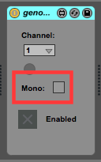

# thesoundoflife
The Sounds of Life — Algorithmically generated music from genome data.

## Introduction
The system has three parts, in Max, Ableton Live and Python. The Python server loads a chromosome file in the .fa format, which contains the characters NCATGcatg, corresponding to the base pairs in a DNA strand. Max sends OSC messages to the Python server, telling the server to read through the DNA sequence. As it does, another part of the Python program generates MIDI rhythm patterns in response to the genome data. Ableton Live contains the samples and instruments that generate the sound itself. Max attaches itself to the Live transport, sending timing information to Python. The Python server returns MIDI note events for each time step, which Max to the Live set to generate sound.

## Running the python server
```
cd python
virtualenv /tmp/dna
source /tmp/dna/bin/activate
pip install -r requirements
python genome_server.py ../data/chromosomes/chr21.fa
```

## Running Ableton + Max
Max will launch automatically when one of the genome Max for Live (M4L) devices is added to the set. The three included sets in this project are:

1. _sol\_master_ – Demo Set packed with effects and automation
2. _sol\_basic_ — Much smaller set, with just a couple of instruments and effects demonstrating usage
3. _sol\_blank_ — An empty set, with just the genome_header and genome_master M4L devices in place. Perfect starting point for an original composition.

# Composing in Ableton Live
Probably the most interesting thing to do with this application is simply to use it to compose music. To do that, you first need to understand how the Live set communicates with the genome_server python process. Let's take it step by step, looking at how you could build a new live set like sol-master one piece at a time.

## Start the genome_server process
```
cd python
virtualenv /tmp/dna
source /tmp/dna/bin/activate
pip install -r requirements
python genome_server.py ../data/chromosomes/chr21.fa
```
Leave this running in Terminal and switch back to the new Live Set.

## Add the genome-master.amxd device to the Set.
1. In Live, select the Master Track (the track all the way on the right)
2. Make sure you're looking at the Device View
3. Drag and Drop the genome-master.amxd device into the view
4. A Max for Live device that looks something like this should appear:


There should only be one such device in the entire Live set. This is the only device that communicates directly with the genome_server python process.

## Parts of the genome-master.amxd

These buttons are for communicating with the server. Push "Ping" and you should see the "Echo" button briefly illuminate, if the genome_server python process is running. The reset button clears all of the currently stored Sequences.


The "AA Rate" number box here displays the number of amino acids that are being read per second. If this number is too low, the "AA Per Read" number can be increased.


Freeze, when active, pauses reading through the chromosome. Auto-reset, when active, clears all Sequences automatically whenever the transport is stopped. The "Reading" indicator will illuminate whenever the chromosome file is actively being read.


Indicators for the position in the current chromosome file, in terms of base pairs and in terms of complete amino acids decoded. The current step (there are 16 steps per measure) is also displayed.


The genome-master amxd will automatically activate and deactivate the other 7 tracks (which must contain the genome-track-header.amxd — more on that later). This indicates which of the 7 other tracks are currently active.


The current state of Live's transport can be controlled here. The indicator will illuminate while th transport is running.


Tempo automation. Here, a particular amino acid can be bound to transport automation. The "Max" number is how many amino acids to read before the counter resets. The menu underneath, which picks between Up, Down or Both, determines whether the Low Frequency Oscillator generated from the amino acid count will be increasing, decreasing or bidirectional. The two number boxes underneath the Tempo indicator set the minimum and maximum value of the tempo.

## Adding a Genome Track
1. In Live, create a new MIDI track
2. Select the track, then make sure you're looking at the Device View
3. Drop the genome-track-header.amxd device into the device view.
4. A Max for Live Device like this one should appear:


This device has very little functionality of its own—it simply receives MIDI events from the genome-master amxd and passes them along to other devices. Once the genome-header M4L device has been added to a track, it will automatically start to receive MIDI note events. These note events will _always_ fall between C1 and G2.

## Parts of the genome-track-header.amxd


Which MIDI channel the track should listen to. The number of channels is currently hardcoded in the conductor.py python file. The four short sequences are channels 1-4, the two medium sequences are channels 5-6, and the one long sequence is on channel 7.


Check the "Mono" toggle to make the instrument play only one note at a time.


The genome-master M4L device will enable and disable each of the genome tracks automatically—this toggle simply indicates whether or not the track is enabled.

## Adding an Amino Acid LFO

In addition to using polypeptides to create rhythmic patterns, the genome_server python process also keeps track of how many of each kind of amino acid it has encountered. The genome-amino-acid-lfo.amxd device creates an LFO whose rate is bound to the count of a particular amino acid. That LFO can be bound to any Live parameter.

1. In Live, select a track with a Live parameter that you would like to automate
2. Make sure you're looking at the Device View
3. Drop the genome-amino-acid-lfo.amxd device anywhere in the device view, after the instrument (even though the device doesn't directly affect the audio that passes through it, it is still technically an Audio Device).
4. You should see a Max for Live Device like this one:


## Parts of the genome-amino-acid-lfo.amxd


The top left dropdown lets you select with amino acid you'd like to monitor for this particular LFO. The "Max" value determines how many amino acids to count before resetting (larger values will build more slowly), and the dropdown underneath determines whether the value will be rising, falling, or bidirectional. The "Control" dial is simply an indicator, and shows the current value of the lfo.


Use these to control what range of the mapped Live parameter is used. In the picture, as the amino acid count increases and decreases, the Live parameter is mapped between 0% and 30% of its overall range.


These controls enable the mapping of the amino acid LFO to any parameter in the Live set. First, click on the "Map" button to enable mapping mode. The button should start flashing; at this point the next click on any parameter in the Live set will bind the LFO to the Live parameter. Once that happens, reading through the genome will cause the value of the LFO to start oscillating, which will drive the Live parameter. This LFO can be used to control a filter sweep, key changes, or any other Live effect.